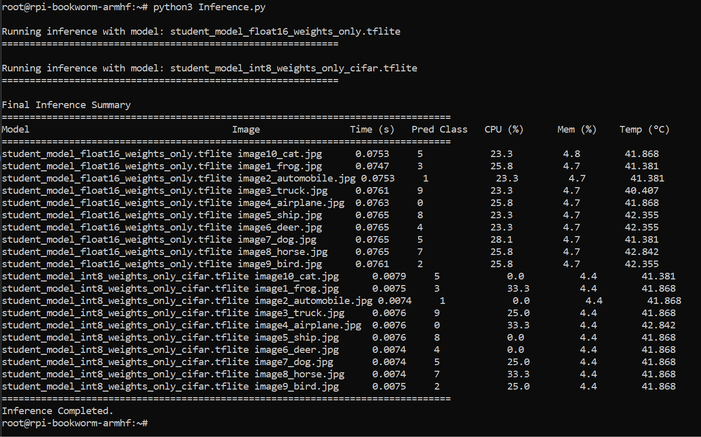

# Edge AI Distillation and TFLite Deployment on Raspberry Pi

This repository documents an edge-AI model-compression and deployment pipeline for CIFAR-10 image classification. The project trains a higher-capacity teacher model, distills its knowledge into a lightweight student model, converts the student model into TensorFlow Lite formats, and benchmarks quantized inference on a Raspberry Pi 4.

The goal is to study how knowledge distillation and quantization affect model accuracy, file size, inference latency, and edge-device resource usage.

---

## Overview

The project is organized into four main parts:

1. **Teacher Model Training**
   - Implements a Hybrid Vision Transformer-style teacher model with a convolutional stem and transformer blocks.
   - Trains the teacher on CIFAR-10 using data augmentation, AdamW, cosine learning-rate decay, checkpointing, and early stopping.
   - Achieves **85.29% test accuracy** on CIFAR-10.

2. **Student Model Distillation**
   - Builds a lightweight MobileNetV2-based student model.
   - Trains the student using knowledge distillation from the teacher model.
   - Combines hard-label cross-entropy loss with soft teacher-student KL-divergence loss.
   - Achieves **75.13% test accuracy** after distillation.

3. **TensorFlow Lite Quantization**
   - Converts the distilled student model into TensorFlow Lite format.
   - Produces two compressed models:
     - FP16 weight-only quantized model
     - INT8 calibrated quantized model with float32 input/output compatibility
   - Reduces model size from roughly **4.7 MB** for the FP16 TFLite model to roughly **2.8 MB** for the INT8 TFLite model.

4. **Raspberry Pi Edge Deployment**
   - Deploys both TFLite models on a Raspberry Pi 4.
   - Runs inference on sample CIFAR-10 images.
   - Measures inference time, predicted class, CPU usage, memory usage, and CPU temperature.

---

## Model Pipeline

The full workflow is:

```text
CIFAR-10 Dataset
      |
      v
Hybrid ViT Teacher Model
      |
      v
Teacher-Student Knowledge Distillation
      |
      v
MobileNetV2 Student Model
      |
      v
TensorFlow Lite Quantization
      |
      +--> FP16 Weight-Only TFLite Model
      |
      +--> INT8 Quantized TFLite Model
      |
      v
Raspberry Pi 4 Inference Benchmark
```

---

## Key Results

| Stage | Result |
|---|---:|
| Teacher model test accuracy | 85.29% |
| Distilled student model test accuracy | 75.13% |
| FP16 TFLite model size | ~4.7 MB |
| INT8 TFLite model size | ~2.8 MB |
| FP16 Raspberry Pi inference time | ~0.075 s / image |
| INT8 Raspberry Pi inference time | ~0.0075 s / image |
| INT8 speedup over FP16 | ~10× |
| Prediction consistency between FP16 and INT8 | 10 / 10 images matched |

---

## Raspberry Pi Inference Summary

The final Raspberry Pi inference benchmark showed that INT8 quantization substantially improved inference speed while preserving prediction behavior on the tested images.

The FP16 model took approximately **0.074–0.077 seconds per image**, while the INT8 model took approximately **0.0074–0.0079 seconds per image**. Both models produced the same predicted classes across all 10 sample images.

Place the final inference screenshot here:

```text
screenshots/inference_summary.png
```

Then display it with:

```markdown

```

Preview:


---

## Main Takeaways

Knowledge distillation successfully transferred useful information from the Hybrid ViT teacher model into a smaller MobileNetV2 student model. Although the student model was much lighter, it still achieved solid CIFAR-10 accuracy after distillation.

TensorFlow Lite quantization made the student model more practical for edge deployment. The INT8 model was significantly smaller and ran roughly **10× faster** than the FP16 model on the Raspberry Pi 4. Importantly, the INT8 model preserved the same predictions as the FP16 model on the tested CIFAR-10 samples, suggesting that quantization improved efficiency without noticeably changing output behavior in this small deployment test.

---

## Technologies Used

- Python
- TensorFlow / Keras
- TensorFlow Lite
- MobileNetV2
- Knowledge Distillation
- Post-Training Quantization
- CIFAR-10
- Raspberry Pi 4
- Linux / SSH / SCP
- NumPy
- PIL
- psutil

---

## Repository Structure

```text
.
├── edge_ai_distillation_tflite_raspberry_pi.ipynb
├── Inference.py
├── README.md
├── models/
│   ├── teacher_model.keras
│   ├── student_model.h5
│   ├── student_model_float16_weights_only.tflite
│   └── student_model_int8_weights_only_cifar.tflite
├── screenshots/
│   └── inference_summary.png
└── images/
    ├── image1_frog.jpg
    ├── image2_automobile.jpg
    ├── image3_truck.jpg
    ├── image4_airplane.jpg
    ├── image5_ship.jpg
    ├── image6_deer.jpg
    ├── image7_dog.jpg
    ├── image8_horse.jpg
    ├── image9_bird.jpg
    └── image10_cat.jpg
```

---

## Notes

The notebook contains the full training, distillation, quantization, and deployment workflow. The Raspberry Pi inference script is separated as `Inference.py` so it can be copied directly to the device and run from the command line.

If this project originated from a course lab, make the repository public only if course policy allows publishing completed lab solutions.
